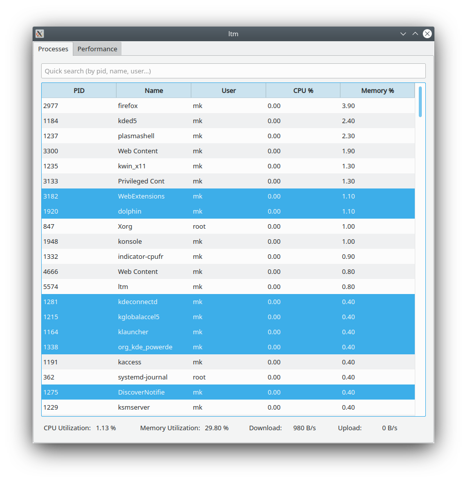
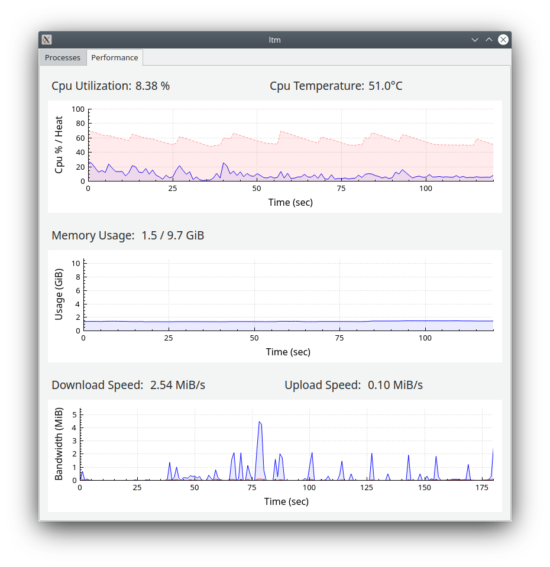

# ltm

ltm is lightweight system monitor for Linux based on Qt5.

 

### Prerequisites

- C++ compiler and Qt5 development files:
```bash
sudo apt-get update
sudo apt-get install g++ qtbase5-dev
```

- GNU tools like `top`, `tr` and `tail` which basically come
preinstalled on vast majority of Linux distros.

### Build and Install
Either

1) Open terminal and type 
```bash
qmake
make -j$(nproc)
```
or

2) Build project using Qt Creator.

### Running

After build process finishes, `ltm` executable should be created.
Eventually, you may need to enable execution of `ltm` binary by `chmod +x ltm`.

### Tested on

* Ryzen 5 3500u CPU, Kubuntu 20.04 
* Ryzen 7 4700u CPU, Kubuntu 22.04
* Ryzen 7 5800u CPU, Kubuntu 22.04
* Ryzen 7 7840u CPU, Kubuntu 23.10 / 24.04

For some other system configurations, minimal changes of `SHELLCMD_` macros may be needed in `include/ShellCommands.h` in order for application to work properly.

### Under the hood

- CPU utilization is calculated from `/proc/stat` file
- CPU temperature is obtained from appropriate file under `/sys/class/hwmon` directory
- Memory Utilization is obtained from `/proc/meminfo` file
- Network bandwidth is calculated by iterating through network interfaces in
`/sys/class/net` directory
- Processes in processes tab are parsed from `top` output
- Plotting in performance tab is done using `QCustomPlot` objects to gain maximum performance

### Licence

[GPL v3] (https://choosealicense.com/licenses/gpl-3.0/)
